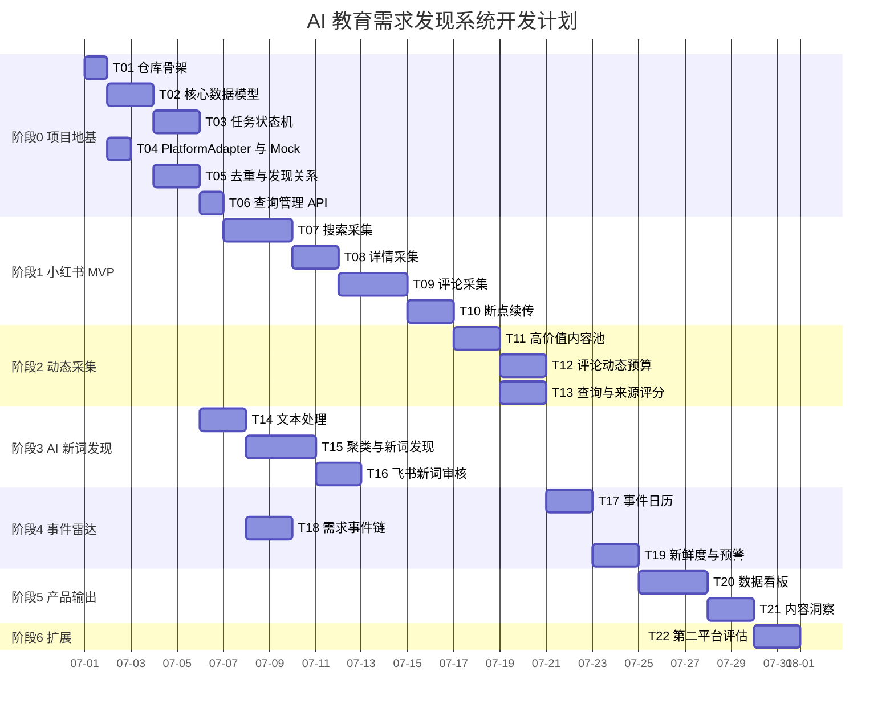

# 项目可视化进度表

> 本文件只能由主控会话更新。子会话不得修改。

## 总体进度

```text
已完成：16 / 22
总体进度：73%

[███████████████░░░░░] 73%
```

## 当前状态

| 项目 | 当前值 |
|---|---|
| 当前阶段 | 阶段 4：事件雷达与预警 |
| 当前主任务 | T17 事件日历 待派发 |
| 执行会话 | W1/W2 待机；W3/W4 关闭 |
| 当前分支 | 主控：`main` |
| 阻塞数量 | 0 |
| 最后更新 | 2026-07-02 04:05 CST：T11-T16 已验收合并；下一步派发 T17-T22 |

## 阶段进度

| 阶段 | 范围 | 任务 | 已完成 | 进度 | 状态 |
|---|---|---:|---:|---:|---|
| 阶段 0 | 项目地基 | T01–T06 | 6/6 | 100% | 已完成 |
| 阶段 1 | 小红书采集 MVP | T07–T10 | 4/4 | 100% | 已完成 |
| 阶段 2 | 动态采集与来源评分 | T11–T13 | 3/3 | 100% | 已完成 |
| 阶段 3 | AI 新词发现 | T14–T16 | 3/3 | 100% | 已完成 |
| 阶段 4 | 事件雷达与预警 | T17–T19 | 0/3 | 0% | 待派发 T17 |
| 阶段 5 | 看板与内容洞察 | T20–T21 | 0/2 | 0% | 未开始 |
| 阶段 6 | 第二平台评估 | T22 | 0/1 | 0% | 未开始 |

## 任务看板

| ID | 任务 | 阶段 | 依赖 | 状态 | 执行会话 | 分支 | 验收 |
|---|---|---|---|---|---|---|---|
| T01 | 仓库骨架 | 0 | 无 | DONE | W1 | `task/T01-repository-scaffold` | ACCEPT：CI 通过 |
| T02 | 核心数据模型 | 0 | T01 | DONE | W1 | `task/T02-core-data-models` | ACCEPT：CI 通过 |
| T03 | 任务状态机 | 0 | T02 | DONE | W1 | `task/T03-task-state-machine` | ACCEPT：CI 通过 |
| T04 | PlatformAdapter 与 Mock | 0 | T01 | DONE | W1 | `task/T04-platform-adapter-mock` | ACCEPT：CI 通过 |
| T05 | 去重与发现关系 | 0 | T02,T04 | DONE | W1 | `task/T05-dedup-discovery-relations` | ACCEPT：CI 通过 |
| T06 | 查询管理 API | 0 | T02,T03 | DONE | W1 | `task/T06-query-management-api` | ACCEPT：CI 通过 |
| T07 | 小红书搜索采集 | 1 | T04,T05,T06 | DONE | W1 | `task/T07-xhs-search-collection` | ACCEPT：`84b47e4`，40 passed |
| T08 | 小红书详情采集 | 1 | T07 | DONE | W1 | `task/T08-xhs-detail-collection` | ACCEPT：`e1d33fb`，45 passed |
| T09 | 小红书评论采集 | 1 | T08 | DONE | W1 | `task/T09-xhs-comment-collection` | ACCEPT：`a76cb0d`，52 passed |
| T10 | 断点续传与部分成功 | 1 | T03,T07,T09 | DONE | W1 | `task/T10-resume-partial-success` | ACCEPT：`3940496`，56 passed |
| T11 | 高价值内容池 | 2 | T09,T10 | DONE | W1 | `task/T11-high-value-source-pool` | ACCEPT：`e4d0631`，61 passed |
| T12 | 评论区动态预算 | 2 | T09,T11 | DONE | W1 | `task/T12-comment-dynamic-budget` | ACCEPT：`6f36f95`，74 passed |
| T13 | 查询与来源评分 | 2 | T06,T11 | DONE | W2 | `task/T13-query-source-scoring` | ACCEPT：`8699b21`，73 passed |
| T14 | 文本处理与低信息标记 | 3 | T05 | DONE | W2 | `task/T14-text-processing-low-info` | ACCEPT：`8b25692`，62 passed |
| T15 | 语义聚类与新词发现 | 3 | T14 | DONE | W3 | `task/T15-semantic-clustering-phrase-discovery` | ACCEPT：`243181d`，71 passed |
| T16 | 飞书新词审核 | 3 | T15 | DONE | W3 | `task/T16-feishu-phrase-review` | ACCEPT：`cbc43bc`，77 passed |
| T17 | 事件日历 | 4 | T06,T13 | TODO | 未分配 | - | 待验收 |
| T18 | 需求事件链 | 4 | T02,T14 | TODO | 未分配 | - | 待验收 |
| T19 | 信号新鲜度与飞书预警 | 4 | T13,T17,T18 | TODO | 未分配 | - | 待验收 |
| T20 | 数据看板 | 5 | T13,T16,T19 | TODO | 未分配 | - | 待验收 |
| T21 | 内容洞察输出 | 5 | T15,T20 | TODO | 未分配 | - | 待验收 |
| T22 | 第二平台评估 | 6 | T20,T21 | TODO | 未分配 | - | 待验收 |

## GitHub 可视化甘特图



> 日期只是初始排期模板。主控会话应根据实际进展调整，不得把估算当成宗教经典。

## 阻塞项

| ID | 阻塞内容 | 影响任务 | 负责人 | 处理状态 |
|---|---|---|---|---|
| - | 当前无阻塞 | - | - | - |

## 最近完成

| 日期 | 任务 | 结果 | 报告 |
|---|---|---|---|
| 2026-07-01 | T01 仓库骨架 | ACCEPT，GitHub CI 通过 | `orchestration/reports/T01.md` |
| 2026-07-01 | T02 核心数据模型 | ACCEPT，GitHub CI 通过 | `orchestration/reports/T02.md` |
| 2026-07-01 | T03 任务状态机 | ACCEPT，GitHub CI 通过 | `orchestration/reports/T03.md` |
| 2026-07-01 | T04 PlatformAdapter 与 Mock | ACCEPT，GitHub CI 通过 | `orchestration/reports/T04.md` |
| 2026-07-01 | T05 去重与发现关系 | ACCEPT，GitHub CI 通过 | `orchestration/reports/T05.md` |
| 2026-07-01 | T06 查询管理 API | ACCEPT，GitHub CI 通过 | `orchestration/reports/T06.md` |
| 2026-07-02 | T07 小红书搜索采集 | ACCEPT，本地 pytest 通过 | `orchestration/reports/T07.md` |
| 2026-07-02 | T08 小红书详情采集 | ACCEPT，本地 pytest 通过 | `orchestration/reports/T08.md` |
| 2026-07-02 | T09 小红书评论采集 | ACCEPT，本地 pytest 通过 | `orchestration/reports/T09.md` |
| 2026-07-02 | T10 断点续传与部分成功 | ACCEPT，本地 pytest 通过 | `orchestration/reports/T10.md` |
| 2026-07-02 | T11 高价值内容池 | ACCEPT，本地 pytest 通过 | `orchestration/reports/T11.md` |
| 2026-07-02 | T12 评论区动态预算 | ACCEPT，本地 pytest 通过 | `orchestration/reports/T12.md` |
| 2026-07-02 | T13 查询与来源评分 | ACCEPT，本地 pytest 通过 | `orchestration/reports/T13.md` |
| 2026-07-02 | T14 文本处理与低信息标记 | ACCEPT，本地 pytest 通过 | `orchestration/reports/T14.md` |
| 2026-07-02 | T15 语义聚类与新词发现 | ACCEPT，本地 pytest 通过 | `orchestration/reports/T15.md` |
| 2026-07-02 | T16 飞书新词审核 | ACCEPT，本地 pytest 通过 | `orchestration/reports/T16.md` |

## 下一步

1. 为 T17-T22 创建任务简报
2. 按依赖顺序新开独立执行对话派发 T17、T18、T19、T20、T21、T22
3. 每个任务完成后验收、合并、更新看板并推送


## 并发管理

| 指标 | 当前值 |
|---|---|
| 默认 Worker 数 | 2 |
| 当前启用 | W1、W2 待机 |
| 建议上限 | 3 |
| 硬上限 | 4 |
| 待验收上限 | 2 |
| 当前待验收 | 0 |
| 当前文件锁 | 0 |

详细状态见：

- `orchestration/WORKER_REGISTRY.md`
- `orchestration/FILE_LOCKS.md`
- `docs/CONCURRENCY_POLICY.md`
