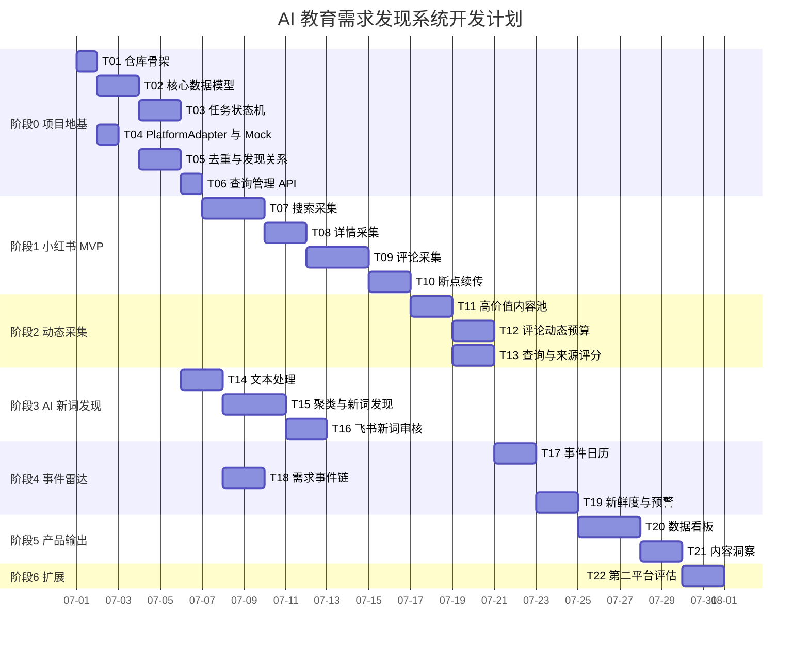

# 项目可视化进度表

> 本文件只能由主控会话更新。子会话不得修改。

## 总体进度

```text
代码任务已完成：22 / 22
真实闭环验收：部分通过，真实小红书私信发送暂时搁置

[█████████████████░░░] 85%
```

## 当前状态

| 项目 | 当前值 |
|---|---|
| 当前阶段 | DeepSeek 筛选 + Campaign 资格判断 + 客户判断工作台 + 飞书人工审核/话术审批 |
| 当前主任务 | 优化普通运营判断体验：`/leads` 承接线索判断，飞书表业务字段前置，`/ops` 只给管理员使用；暂不做新的小红书采集 |
| 执行会话 | 主控单会话 |
| 当前分支 | `main` |
| 阻塞数量 | 4 |
| 最后更新 | 2026-07-14：评论回复远程 Windows CDP + 独立持久任务已通过全量自动测试（494 passed, 7 skipped）；Worker 禁止本地浏览器回退；live 验收仍因 Windows CDP/SSH 断开及测试目标配置缺失而阻塞 |

## 阶段进度

| 阶段 | 范围 | 任务 | 已完成 | 进度 | 状态 |
|---|---|---:|---:|---:|---|
| 阶段 0 | 项目地基 | T01–T06 | 6/6 | 100% | 已完成 |
| 阶段 1 | 小红书采集 MVP | T07–T10 | 4/4 | 100% | 已完成 |
| 阶段 2 | 动态采集与来源评分 | T11–T13 | 3/3 | 100% | 已完成 |
| 阶段 3 | AI 新词发现 | T14–T16 | 3/3 | 100% | 已完成 |
| 阶段 4 | 事件雷达与预警 | T17–T19 | 3/3 | 100% | 已完成 |
| 阶段 5 | 看板与内容洞察 | T20–T21 | 2/2 | 100% | 已完成 |
| 阶段 6 | 第二平台评估 | T22 | 1/1 | 100% | 已完成 |

## 任务看板

| ID | 任务 | 阶段 | 依赖 | 状态 | 执行会话 | 分支 | 验收 |
|---|---|---|---|---|---|---|---|
| T01 | 仓库骨架 | 0 | 无 | DONE | W1 | `task/T01-repository-scaffold` | ACCEPT：CI 通过 |
| T02 | 核心数据模型 | 0 | T01 | DONE | W1 | `task/T02-core-data-models` | ACCEPT：CI 通过 |
| T03 | 任务状态机 | 0 | T02 | DONE | W1 | `task/T03-task-state-machine` | ACCEPT：CI 通过 |
| T04 | PlatformAdapter 与 Mock | 0 | T01 | DONE | W1 | `task/T04-platform-adapter-mock` | ACCEPT：CI 通过 |
| T05 | 去重与发现关系 | 0 | T02,T04 | DONE | W1 | `task/T05-dedup-discovery-relations` | ACCEPT：CI 通过 |
| T06 | 查询管理 API | 0 | T02,T03 | DONE | W1 | `task/T06-query-management-api` | ACCEPT：CI 通过 |
| T07 | 小红书搜索采集 | 1 | T04,T05,T06 | DONE | W1 | `task/T07-xhs-search-collection` | ACCEPT：`84b47e4`，40 passed |
| T08 | 小红书详情采集 | 1 | T07 | DONE | W1 | `task/T08-xhs-detail-collection` | ACCEPT：`e1d33fb`，45 passed |
| T09 | 小红书评论采集 | 1 | T08 | DONE | W1 | `task/T09-xhs-comment-collection` | ACCEPT：`a76cb0d`，52 passed |
| T10 | 断点续传与部分成功 | 1 | T03,T07,T09 | DONE | W1 | `task/T10-resume-partial-success` | ACCEPT：`3940496`，56 passed |
| T11 | 高价值内容池 | 2 | T09,T10 | DONE | W1 | `task/T11-high-value-source-pool` | ACCEPT：`e4d0631`，61 passed |
| T12 | 评论区动态预算 | 2 | T09,T11 | DONE | W1 | `task/T12-comment-dynamic-budget` | ACCEPT：`6f36f95`，74 passed |
| T13 | 查询与来源评分 | 2 | T06,T11 | DONE | W2 | `task/T13-query-source-scoring` | ACCEPT：`8699b21`，73 passed |
| T14 | 文本处理与低信息标记 | 3 | T05 | DONE | W2 | `task/T14-text-processing-low-info` | ACCEPT：`8b25692`，62 passed |
| T15 | 语义聚类与新词发现 | 3 | T14 | DONE | W3 | `task/T15-semantic-clustering-phrase-discovery` | ACCEPT：`243181d`，71 passed |
| T16 | 飞书新词审核 | 3 | T15 | DONE | W3 | `task/T16-feishu-phrase-review` | ACCEPT：`cbc43bc`，77 passed |
| T17 | 事件日历 | 4 | T06,T13 | DONE | W1 | `task/T17-event-calendar` | ACCEPT：`514e8b9`，97 passed |
| T18 | 需求事件链 | 4 | T02,T14 | DONE | W2 | `task/T18-demand-event-chain` | ACCEPT：`4d9ef37`，95 passed |
| T19 | 信号新鲜度与飞书预警 | 4 | T13,T17,T18 | DONE | W1 | `task/T19-signal-freshness-alerts` | ACCEPT：`e2809b7`，106 passed |
| T20 | 数据看板 | 5 | T13,T16,T19 | DONE | W1 | `task/T20-data-dashboard` | ACCEPT：`fbb8e44`，110 passed |
| T21 | 内容洞察输出 | 5 | T15,T20 | DONE | W1 | `task/T21-content-insights` | ACCEPT：`46a1b13`，114 passed |
| T22 | 第二平台评估 | 6 | T20,T21 | DONE | W1 | `task/T22-second-platform-evaluation` | ACCEPT：`9bf7f40`，120 passed |

## GitHub 可视化甘特图



> 日期只是初始排期模板。主控会话应根据实际进展调整，不得把估算当成宗教经典。

## 阻塞项

| ID | 阻塞内容 | 影响任务 | 负责人 | 处理状态 |
|---|---|---|---|---|
| V0-B1 | Docker 未安装，Compose 不可用；当前使用 Homebrew PostgreSQL | Docker 环境复现 | 用户/环境 | 已记录替代环境 |
| V0-B2 | 未配置飞书凭证 | 真实飞书发送与回调验证 | 用户/环境 | 待配置 |
| V0-B3 | 未完成 4-8 小时长期运行 | 稳定性验收 | 主控/环境 | 待执行 |
| V15-B1 | 真实 Pipeline Runner 长期运行尚未完整记录 | 稳定采集验收 | 主控/环境 | 待观察 |
| V15-B2 | AI 筛选仍是规则型，61 条待人工确认里有噪音 | AI 自动获客质量 | 主控/业务 | 待人工审核和大模型二次评分 |
| V15-B3 | `feishu-ai-review-sync` 已实现但尚未挂入飞书系统控制台或 worker | 普通用户触发新数据进入 AI 筛选表 | 主控 | 待接入控制台/worker |
| V15-B4 | 当前浏览器/网络环境无法稳定打开小红书私信页，且用户要求不要改 Clash | 真实小红书自动私信发送 | 环境/主控 | 暂时搁置；飞书按钮只审批入库 |

## 最近完成

| 日期 | 任务 | 结果 | 报告 |
|---|---|---|---|
| 2026-07-09 | 客户判断工作台与角色边界 | `/leads` 增加业务摘要、为什么推荐、证据展开、新鲜度/SLA 和人工判断动作；飞书 AI 筛选字段业务前置；`/ops` 增加管理员边界和危险操作确认 | `README.md` / `HANDOFF.md` |
| 2026-07-09 | 飞书 AI 筛选增量同步 | 新增 `feishu-ai-review-sync`，把 `lead_screening_results` 的 DeepSeek 新结果增量写入 `AI筛选客户线索` / `AI筛选证据明细`，重复执行不重复创建 | `README.md` |
| 2026-07-09 | 主线整理与话术发送降风险 | `feat/v15-agent-neutral-runtime` 已合并推送到 `main`；飞书话术审批按钮改为 `approved_to_send`，不再在回调线程里直接发送小红书；完整测试 `301 passed, 4 skipped, 1 warning` | `HANDOFF.md` |
| 2026-07-12 | 飞书审批后评论回复 | 自动化实现、运行手册和默认关闭的 live contract 完成；真实发送验收阻塞于专用测试目标、selector probe 和飞书人工明确批准，不得宣称已真实发送 | `docs/COMMENT_REPLY_OPERATIONS.md` |
| 2026-07-07 | Campaign 资格判断与地区证据模型 | 新增可配置 Campaign、LocationPolicy、LocationEvidence、资格判断字段和小红书公开 IP 属地映射基础 | `docs/QUALIFICATION_ARCHITECTURE_AUDIT.md` |
| 2026-07-06 | 飞书系统控制台 | 新增 `系统控制台` 表和 `run-control-panel-once`，人工改 `开始执行=是，开始` 后系统只执行一次并写回结果 | `docs/reports/FEISHU_WORKBENCH_VERIFICATION.md` |
| 2026-07-06 | 飞书 AI 筛选工作台 | 71 个客户线索、72 条证据写入 Base；新增待人工确认卡片、高意向、可跟进、已忽略视图 | `docs/reports/FEISHU_WORKBENCH_VERIFICATION.md` |
| 2026-07-06 | 飞书 lark-cli 同步 | `FEISHU_BITABLE_TRANSPORT=lark_cli` 验证可创建/更新客户跟进记录，并可拉回反馈 | `docs/reports/FEISHU_WORKBENCH_VERIFICATION.md` |
| 2026-07-03 | V15 Agent 中立运行框架 | Pipeline Runner/CLI/REST/运行状态接通；自动测试通过；真实平台验证未完成 | `docs/V15_AGENT_NEUTRAL_RUNTIME_REPORT.md` |
| 2026-07-03 | AI 自动获客最小闭环 | `leads`/证据/待完善任务、历史回填、Pipeline 增量接入、`/leads` 页面完成；后续 2026-07-06 已以飞书 AI 筛选工作台承接人工审核 | `docs/superpowers/specs/2026-07-03-ai-leads-business-loop-design.md` |
| 2026-07-01 | T01 仓库骨架 | ACCEPT，GitHub CI 通过 | `orchestration/reports/T01.md` |
| 2026-07-01 | T02 核心数据模型 | ACCEPT，GitHub CI 通过 | `orchestration/reports/T02.md` |
| 2026-07-01 | T03 任务状态机 | ACCEPT，GitHub CI 通过 | `orchestration/reports/T03.md` |
| 2026-07-01 | T04 PlatformAdapter 与 Mock | ACCEPT，GitHub CI 通过 | `orchestration/reports/T04.md` |
| 2026-07-01 | T05 去重与发现关系 | ACCEPT，GitHub CI 通过 | `orchestration/reports/T05.md` |
| 2026-07-01 | T06 查询管理 API | ACCEPT，GitHub CI 通过 | `orchestration/reports/T06.md` |
| 2026-07-02 | T07 小红书搜索采集 | ACCEPT，本地 pytest 通过 | `orchestration/reports/T07.md` |
| 2026-07-02 | T08 小红书详情采集 | ACCEPT，本地 pytest 通过 | `orchestration/reports/T08.md` |
| 2026-07-02 | T09 小红书评论采集 | ACCEPT，本地 pytest 通过 | `orchestration/reports/T09.md` |
| 2026-07-02 | T10 断点续传与部分成功 | ACCEPT，本地 pytest 通过 | `orchestration/reports/T10.md` |
| 2026-07-02 | T11 高价值内容池 | ACCEPT，本地 pytest 通过 | `orchestration/reports/T11.md` |
| 2026-07-02 | T12 评论区动态预算 | ACCEPT，本地 pytest 通过 | `orchestration/reports/T12.md` |
| 2026-07-02 | T13 查询与来源评分 | ACCEPT，本地 pytest 通过 | `orchestration/reports/T13.md` |
| 2026-07-02 | T14 文本处理与低信息标记 | ACCEPT，本地 pytest 通过 | `orchestration/reports/T14.md` |
| 2026-07-02 | T15 语义聚类与新词发现 | ACCEPT，本地 pytest 通过 | `orchestration/reports/T15.md` |
| 2026-07-02 | T16 飞书新词审核 | ACCEPT，本地 pytest 通过 | `orchestration/reports/T16.md` |
| 2026-07-02 | T17 事件日历 | ACCEPT，本地 pytest 通过 | `orchestration/reports/T17.md` |
| 2026-07-02 | T18 需求事件链 | ACCEPT，本地 pytest 通过 | `orchestration/reports/T18.md` |
| 2026-07-02 | T19 信号新鲜度与飞书预警 | ACCEPT，本地 pytest 通过 | `orchestration/reports/T19.md` |
| 2026-07-02 | T20 数据看板 | ACCEPT，本地 pytest 通过 | `orchestration/reports/T20.md` |
| 2026-07-02 | T21 内容洞察输出 | ACCEPT，本地 pytest 通过 | `orchestration/reports/T21.md` |
| 2026-07-02 | T22 第二平台评估 | ACCEPT，本地 pytest 通过 | `orchestration/reports/T22.md` |

## 下一步

1. 暂不做新采集，继续用旧数据验证 DeepSeek、Campaign、飞书审核、`feishu-ai-review-sync` 和话术审批状态流转。
2. 把 `feishu-ai-review-sync` 挂到飞书 `系统控制台` 或后续 worker，让普通用户能显式触发。
3. 在 `待人工确认卡片` 视图审核 61 个候选客户，标记 `可跟进` 或 `已忽略`，记录误判类型并反哺 `/leads` 判断文案。
4. 新建“客户审核卡片表”或调整主字段，让卡片标题直接显示 `需求摘要`。
5. 评论回复 live acceptance：准备专用测试评论，先做只读 selector probe，再由飞书人工明确批准一次发送；`result_unknown` 不得盲目重试。


## 并发管理

| 指标 | 当前值 |
|---|---|
| 默认 Worker 数 | 2 |
| 当前启用 | W1、W2 待机 |
| 建议上限 | 3 |
| 硬上限 | 4 |
| 待验收上限 | 2 |
| 当前待验收 | 0 |
| 当前文件锁 | 0 |

详细状态见：

- `orchestration/WORKER_REGISTRY.md`
- `orchestration/FILE_LOCKS.md`
- `docs/CONCURRENCY_POLICY.md`

## V16 状态（2026-07-14）

| 模块 | 状态 | 说明 |
|---|---|---|
| Skill Registry | DONE | 仅 `screen_historical_leads` |
| Skill Run/Event | DONE | PostgreSQL 事实源、事件幂等、断点恢复 |
| Worker | DONE | `skill_run_execute` 直接复用 Python service |
| 飞书任务中心 | LIVE_FULL_RUN_PASSED | Run `#8` 已完成创建、参数、预览、确认、Worker 50/50 和最终结果卡；localtunnel 仍是非生产风险 |
| 小红书访问/发送 | NOT IN SCOPE | V16 全程禁止 |

V16 自动化验收：`510 passed, 7 skipped, 1 warning`；迁移 head `0016_skill_runs`。

V16 真实安全验收：Run `#1` 成功，处理 3 / 有效需求 1 / 待确认 3；飞书同卡片更新成功，AI 审核 Base 新增 2 条记录。2026-07-15 已从旧 API 日志确认 `200671` 的代码根因是 Card 2.0 动作位于 `event.action.value.action` 却被误路由到 LLM 审核并返回 400；动作解析和官方响应协议已修复。

2026-07-15 最终“创建任务”真实验收：应用 `1.0.2` 已在线；保持原 HTTP 地址不变，重启 `three-emus-kick` localtunnel 会话并发送新卡 `om_x100b6a5c096318a4b1ca479dccbd4b8` 后，用户点击成功，飞书服务器请求进入 API 并返回 HTTP 200，PostgreSQL 创建 `Skill Run #8`。完整配置和排障步骤见 `docs/FEISHU_CARD_CALLBACK_RUNBOOK.md`。

Run `#8` 后续真实闭环：修复 `select_static.label` 非法字段和表单按钮缺少 callback behavior 后，预览 50 条并确认运行，Worker task `#358` 完成 50/50；结果为有效需求 0、高意向 0、待确认 50，飞书同步 dry-run 无失败。Worker `.env` 和 bot PATCH 修复后，同一张消息更新为“任务完成”。

## 2026-07-15 V16 结果闭环补验收

- `查看结果`：已从重复摘要修正为独立结果详情卡。
- Base 自动同步：Run `#8` 已真实新增客户 50、证据 50，失败 0；未重新执行 DeepSeek。
- 同步可见性：结果卡明确区分 live / partial failure / dry-run，并提供客户线索和证据明细入口。
- 数据一致性：PostgreSQL 已恢复 100 条飞书 record 映射；同一任务卡已更新为结果详情。
- 自动化验证：`513 passed, 7 skipped, 1 warning in 26.51s`；编译和 diff 检查通过。

## V17 人工审核工作台与 Founder Copilot

| 模块 | 状态 | 说明 |
|---|---|---|
| 产品设计 | DONE | `docs/FOUNDER_COPILOT.md` |
| Codex 专用交接 | DONE | 约每 2–3 天基于证据反馈，Codex 自主判断时机 |
| Base 审核工作台 | TODO | 主表审核字段、卡片视图、审核记录表 |
| Base 工作流 | TODO | 有效、无效、待二审、重新分析、进入跟进 |
| PostgreSQL 回写 | TODO | 审核动作幂等同步，PostgreSQL 保持事实源 |
| 成长观察自动化 | DESIGN_ONLY | 先按文档人工执行，不提前增加复杂模型或定时系统 |
